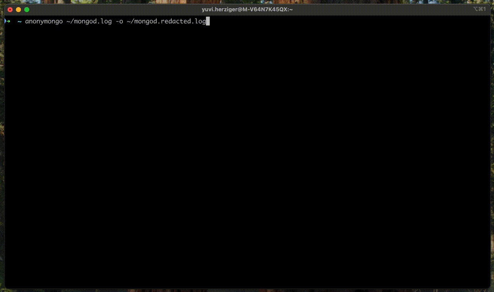
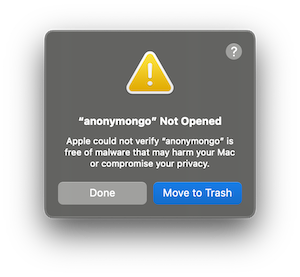
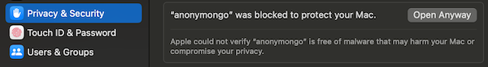

# anonymongo

[](https://github.com/yuvalherziger/anonymongo/actions/workflows/test.yml)
[](https://github.com/yuvalherziger/anonymongo/actions/workflows/release.yml)
[](https://github.com/yuvalherziger/anonymongo/releases)

---

Redact sensitive values from MongoDB log files before sharing them, and preserve value types and formats.

---

## Table of Contents

- [anonymongo](#anonymongo)
  - [Table of Contents](#table-of-contents)
  - [1. Installation](#1-installation)
    - [1.1 Homebrew](#11-homebrew)
    - [1.2 Release download](#12-release-download)
    - [1.3 Build from source](#13-build-from-source)
  - [2. Usage](#2-usage)
  - [3. Tests](#3-tests)
  - [4. Adding anonymongo to trusted software on macOS](#4-adding-anonymongo-to-trusted-software-on-macos)
  - [5. Disclaimer](#5-disclaimer)

---



## 1. Installation

### 1.1 Homebrew

Run the following to install anonymongo with Homebrew on your macOS:

```shell
brew install --cask yuvalherziger/anonymongo/anonymongo
```

Run to the following to verify the installation:

```shell
anonymongo version
```

**Please note**: If you receive a prompt warning you that the developer of the software
is not trusted, please follow the instructions in [4. Adding anonymongo to trusted software on macOS](#4-adding-anonymongo-to-trusted-software-on-macos).

### 1.2 Release download

Browse to this repository's [release page](https://github.com/yuvalherziger/anonymongo/releases) and
download the latest stable release for your OS and architecture (e.g., `anonymongo_Windows_x86_64.zip`).

Here's the full list of the latest stable (0.3.x) binaries for your convenience:

- [macOS M-type chip](https://github.com/yuvalherziger/anonymongo/releases/download/0.3.0/anonymongo_Darwin_arm64.tar.gz)
- [macOS Intel chip](https://github.com/yuvalherziger/anonymongo/releases/download/0.3.0/anonymongo_Darwin_x86_64.tar.gz)
- [Windows x86_64](https://github.com/yuvalherziger/anonymongo/releases/download/0.3.0/anonymongo_Windows_x86_64.zip)
- [Windows arm64](https://github.com/yuvalherziger/anonymongo/releases/download/0.3.0/anonymongo_Windows_arm64.zip)
- [Linux arm64](https://github.com/yuvalherziger/anonymongo/releases/download/0.3.0/anonymongo_Linux_arm64.tar.gz)
- [Linux x86_64](https://github.com/yuvalherziger/anonymongo/releases/download/0.3.0/anonymongo_Linux_x86_64.tar.gz)

Extract the downloaded archive and run the `anonymongo` binary. Depending on the OS settings, you may be prompted to allow the program explicitly.

```shell
anonymongo version
```

### 1.3 Build from source

To build and run `anonymongo` from source, follow these steps:

1. Clone the repository

    ```shell
    git clone https://github.com/yuvalherziger/anonymongo.git
    cd anonymongo
    ```

2. Build the binary

    Ensure you have [Go](https://golang.org/dl/) (version 1.18 or higher) installed.

    ```shell
    make build
    ```

    This will create an executable named `anonymongo` in the project root.

3. **Run the application**

    You can now run `anonymongo` directly:

    ```shell
    ./dist/anonymongo --help
    ```

    Or process a log file:

    ```shell
    ./dist/anonymongo path/to/mongod.log
    ```

4. **(Optional) Run tests**

    To verify your build, run the tests:

    ```shell
    make test
    ```

For more build options or troubleshooting, see the [Go documentation](https://golang.org/doc/).

## 2. Usage

tl;dr: `anonymongo --help`

```
Redact MongoDB log files by replacing sensitive information with generic placeholders.

You can provide input either as a file (as the first argument) or by piping logs to stdin.

Usage:
  anonymongo [JSON file or gzipped MongoDB log file] [flags]
  anonymongo [command]

Available Commands:
  completion  Generate the autocompletion script for the specified shell
  help        Help about any command
  version     Print the version number

Flags:
  -h, --help                             help for anonymongo
  -o, --outputFile string                Write output to file instead of stdout
  -z, --redact-field-names stringArray   [EXPERIMENTAL] Specify namespaces whose field names should be redacted in
                                         addition to their values. The structure is either a namespace; e.g., 'dbName.collName'
  -b, --redactBooleans                   Redact boolean values to false
  -i, --redactIPs                        Redact network locations to 255.255.255.255:65535
  -n, --redactNumbers                    Redact numeric values to 0
  -r, --replacement string               Replacement string for redacted values (default "REDACTED")

Use "anonymongo [command] --help" for more information about a command.
```

Examples:


```shell
# Redact and write the results to a file
anonymongo mongod.log --outputFile mongod.redacted.log

# Redact logs and gzipped logs straight to standard output:
anonymongo mongod.log

# Pipe logs with stdin:
cat mongod.log | grep "Slow query" | anonymongo

# Redact booleans to constant `false`
anonymongo mongod.log --redactBooleans

# Redact numeric values to constant `0`
anonymongo mongod.log --redactNumbers

# Redact network locations to constant `255.255.255.255:65535`
anonymongo mongod.log --redactIPs

# Change the default redaction replacement string
anonymongo mongod.log --replacement "some other redaction placeholder"

# Experimental feature: Redact field names in specific namespaces in addition to their values.
anonymongo mongod.log --outputFile mongod.redacted.log \
  --redact-field-names <namespace> \
  --redact-field-names <namespace>
```

## 3. Tests

Every new refactoring case must be covered by a test to ensure the expected results are yielded and no
regression is introducesd. The source code contains a single unit test: [./src/anonymizer_test.go](./src/anonymizer_test.go).
It's a parameterized unit test, where each test is a go struct with the following information:

* Test name (e.g., "$expr redaction inside $lookup stage")
* Input file: a relative path to a JSON text file input containing a single log entry
* Options: a preset function to determine the conditions for the test (e.g., flags, overrides, etc.)
* A mapping of JSON paths and their expected post-redaction values.

Below is an example of such element you can append to the parameterized cases:

```go
{
  Name:          "$expr redaction inside $lookup stage",
  InputFile:     "test_data/expr_in_lookup_pipeline.json",
  Options:       setOptionsRedactedStrings,
  ExpectedPaths: map[string]interface{}{
    "command.pipeline.1.$lookup.pipeline.0.$match.$expr.$eq.1": "REDACTED",
  },
}
```

Run the tests the following way:

```shell
make test
```

## 4. Adding anonymongo to trusted software on macOS

**Please note**: You will probably need to tell your macOS to trust
this project. When you `anonymongo` for the first time, you'll be warned that the project
isn't built by a known Apple developer:

1. Run `anonymongo version` for the first time.
2. A warning will pop up - click ***Done*** (**do not** click the "Move to trash" button):
   
   

3. Go to ***System Settings*** -> ***Privacy & Security***, and click the ***Open Anyway*** button. You will be prompted again - click
   ***Open Anyway*** again.

   

4. You can now run `anonymongo`.

## 5. Disclaimer

This software is not supported by MongoDB, Inc. under any of their commercial support subscriptions or otherwise.
Any usage of anonymongo is at your own risk. Bug reports, feature requests, and questions can be posted in the
[Issues section](https://github.com/yuvalherziger/anonymongo/issues) of this repository.
