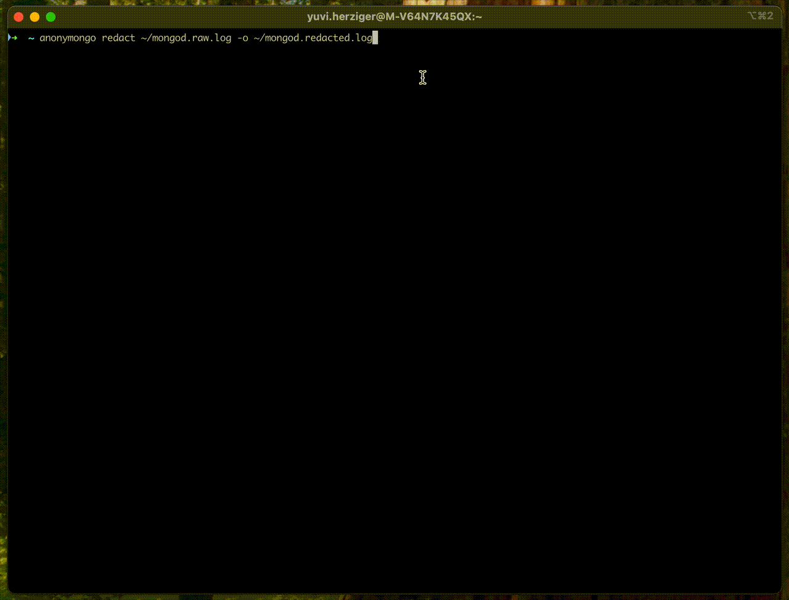

# anonymongo

[](https://github.com/yuvalherziger/anonymongo/actions/workflows/test.yml)
[](https://github.com/yuvalherziger/anonymongo/actions/workflows/nancy.yml)
[](https://github.com/yuvalherziger/anonymongo/actions/workflows/release.yml)
[](https://github.com/yuvalherziger/anonymongo/releases)
[](https://codecov.io/gh/yuvalherziger/anonymongo)

---



---

Redact sensitive values from MongoDB log files before sharing them, and preserve value types and formats.

Main features:

* **Type-aware redaction**: Strings, numerics, booleans, ISO Dates, Object IDs, email addresses, and binary data.
* **Eager redaction**: Redact field names from specified namespaces for dynamic schemas that contain sensitive values in field names.
* **Flexible input**: Redact an input file, an stdin stream, or Atlas cluster logs.
* **Flexible output**: Redact to an output file or to stdout.
* **Complete insights preservation**: The logs will be redacted of any sensitive information, but the analysis of the log file will remain intact.
* Change the default redaction placeholder string (default: `"REDACTED"`)
* **Read logs from Atlas Clusters**: Redact logs straight from MongoDB Atlas clusters. This feature requires an Atlas API key (see [Atlas Administration API](https://www.mongodb.com/docs/atlas/api/atlas-admin-api/)).
* **Reversible encryption**: Encrypt strings in the log file to preserve the original values while
  still redacting them from the log file. The encrypted values can be decrypted later using the same key.

---

## Table of Contents

- [anonymongo](#anonymongo)
    * [Table of Contents](#table-of-contents)
    * [1. Installation](#1-installation)
        + [1.1 Homebrew](#11-homebrew)
        + [1.2 Release download](#12-release-download)
        + [1.3 Build from source](#13-build-from-source)
    * [2. Usage](#2-usage)
        + [2.1 The `anonymongo redact` Command](#21-the-anonymongo-redact-command)
            - [2.1.1 Read from a file](#211-read-from-a-file)
            - [2.1.2 Write to a file](#212-write-to-a-file)
            - [2.1.3 Read Atlas cluster logs](#213-read-atlas-cluster-logs)
            - [2.1.4 Use stdin and/or stdout](#214-use-stdin-andor-stdout)
            - [2.1.5 Reversible Encryption](#215-reversible-encryption)
            - [2.1.6 Eager Redaction](#216-eager-redaction)
            - [2.1.7 Additional redaction Options](#217-additional-redaction-options)
                * [2.1.7.1 `--replacement <STRING>`](#2171-replacement-string)
                * [2.1.7.2 `--redactBooleans` ](#2172-redactbooleans)
                * [2.1.7.3 `--redactNumbers`](#2173-redactnumbers)
        + [2.2 The `anonymongo decrypt` Command](#22-the-anonymongo-decrypt-command)
    * [3. Tests](#3-tests)
    * [4. Adding anonymongo to trusted software on macOS](#4-adding-anonymongo-to-trusted-software-on-macos)
    * [5. Disclaimer](#5-disclaimer)

---

## 1. Installation

### 1.1 Homebrew

Run the following command to install anonymongo with Homebrew on your macOS:

```shell
brew install --cask yuvalherziger/anonymongo/anonymongo
```

Run the following command to verify the installation:

```shell
anonymongo version
```

Optional, but recommended: run the following command to take `anonymongo` out of quarantine in your shell:

```shell
xattr -d com.apple.quarantine $(which anonymongo) \
  && echo "You can now run anonymongo" \
  || echo "anonymongo already out of quarantine"
```

**Please note**: If you didn't run the last command above, you will likely receive a prompt warning you that the developer of this software
is not trusted. If you prefer to move it out of quarantine manually, please follow the instructions in [4. Adding anonymongo to trusted software on macOS](#4-adding-anonymongo-to-trusted-software-on-macos).

### 1.2 Release download

Browse to this repository's [release page](https://github.com/yuvalherziger/anonymongo/releases) and
download the latest stable release for your OS and architecture (e.g., `anonymongo_Windows_x86_64.zip`).

Here's the full list of the latest stable (0.3.x) binaries for your convenience:

- [macOS M-type chip](https://github.com/yuvalherziger/anonymongo/releases/download/1.0.0/anonymongo_Darwin_arm64.tar.gz)
- [macOS Intel chip](https://github.com/yuvalherziger/anonymongo/releases/download/1.0.0/anonymongo_Darwin_x86_64.tar.gz)
- [Windows x86_64](https://github.com/yuvalherziger/anonymongo/releases/download/1.0.0/anonymongo_Windows_x86_64.zip)
- [Windows arm64](https://github.com/yuvalherziger/anonymongo/releases/download/1.0.0/anonymongo_Windows_arm64.zip)
- [Linux arm64](https://github.com/yuvalherziger/anonymongo/releases/download/1.0.0/anonymongo_Linux_arm64.tar.gz)
- [Linux x86_64](https://github.com/yuvalherziger/anonymongo/releases/download/1.0.0/anonymongo_Linux_x86_64.tar.gz)

Extract the downloaded archive and run the `anonymongo` binary. Depending on the OS settings, you may be prompted to trust the program explicitly.

```shell
anonymongo version
```

### 1.3 Build from source

To build and run `anonymongo` from source, follow these steps:

1. Clone the repository

    ```shell
    git clone https://github.com/yuvalherziger/anonymongo.git
    cd anonymongo
    ```

2. Build the binary

    Ensure you have [Go](https://golang.org/dl/) (version 1.18 or higher) installed.

    ```shell
    make build
    ```

    This will create an executable named `anonymongo` under the `./dist` directory.

3. **Run the application**

    You can now run `anonymongo` directly:

    ```shell
    ./dist/anonymongo --help
    ```

    Or process a log file:

    ```shell
    ./dist/anonymongo path/to/mongod.log
    ```

4. **(Optional) Run tests**

    To verify your build, run the tests:

    ```shell
    make test
    ```

For more build options or troubleshooting, see the [Go documentation](https://golang.org/doc/).

## 2. Usage

tl;dr: `anonymongo --help`

### 2.1 The `anonymongo redact` Command

Redact MongoDB logs.

#### 2.1.1 Read from a file

The only positional parameter of the `anonymongo redact` command is the path to the MongoDB log file you want to redact.
Example below:

```shell
anonymongo mongod.log --outputFile mongod.redacted.log
```

#### 2.1.2 Write to a file

You can redact a MongoDB log file to a new file using the `--outputFile` flag. This flag tells anonymongo to create a
new file in the specified path and write the redacted logs to it. If the file already exists, it will be overwritten.

```shell
# Redact and write the results to a file
anonymongo mongod.log --outputFile mongod.redacted.log
```

#### 2.1.3 Read Atlas cluster logs

You can redact logs straight from a MongoDB Atlas cluster using the `--atlasClusterName` and `--atlasProjectId` flags.

```shell

# Redact logs from an Atlas cluster
ATLAS_PUBLIC_KEY=<API_PUBLIC_KEY> \
ATLAS_PRIVATE_KEY=<API_PRIVATE_KEY> \
anonymongo --atlasClusterName <CLUSTER_NAME> \
  --atlasProjectId <ATLAS_PROJECT_ID> \
  --outputFile ./mongod.redacted.log
```

Please note: you cannot redact Atlas cluster logs to stdout.

#### 2.1.4 Use stdin and/or stdout

You can also pipe logs to `anonymongo` using stdin. This is useful for redacting logs from a command or a file without
creating intermediate files.

You can read from stdin and write to a file using the `--outputFile` flag. For example:

```shell
cat mongod.log | grep "Slow query" | anonymongo --outputFile slow_queries.redacted.log
```

You can read from a file and pipe results to stdout by omitting the `--outputFile` flag. For example:

```shell
anonymongo --outputFile slow_queries.redacted.log | tee slow_queries.redacted.log
```

You can use stdin and stdout together, which is useful for intermediate analysis. For example:

```shell
cat mongod.log | grep "Slow query" | anonymongo | grep -m 1 "shouldnot@be.here"
```

#### 2.1.5 Reversible Encryption

You can use the `--encrypt` flag to encrypt redacted strings in the log file. This is useful for preserving the original
values while still redacting them from the log file. The encrypted values can be decrypted later using the same key.

To use this feature, you need to provide a key using the `--encryptionKey` flag. The key must be a 32-byte base64-encoded string.

```shell
anonymongo mongod.log --outputFile mongod.redacted.log --encrypt --encryptionKey ./anonymongo.enc.key
```

The `--encryptionKey` flag is optional. If you don't provide it, a random key will be generated in the current directory
under the name `anonymongo.enc.key`. You can use this key to decrypt individual string values
(see: [The `anonymongo decrypt` Command](#22-the-anonymongo-decrypt-command).

Limitations:

- You cannot use the `--encrypt` flag with neither stdin nor stdout.
- The encryption key must be a 32-byte base64-encoded AES256 SIV-based key, as `anonymongo` uses SIV for encryption.
  It's recommended that you allow `anonymongo` to generate a random key for you. It will be stored in the current
  directory under the name, and you can move it to a secure location for later use (e.g., a key management store).

#### 2.1.6 Eager Redaction

This is an **experimental feature** that allows you to redact field names in specific namespaces in addition to their
values. This is useful for dynamic schemas that contain sensitive values in field names. For example, if you have a
collection named `users` in the `app` database that potentially contains sensitive information in field names, you can
redact the field names in that namespace using the `--redact-field-names` flag. For example:

```shell
anonymongo mongod.log --outputFile mongod.redacted.log \
  --redact-field-names app.users
```

You can also specify multiple namespaces to redact field names from.

#### 2.1.7 Additional redaction Options

##### 2.1.7.1 `--replacement <STRING>`

The `--replacement` flag allows you to change the default redaction placeholder string (default: `"REDACTED"`). 
The replacement string is ignored if using the `--encrypt` flag.

##### 2.1.7.2 `--redactBooleans` 

The `--redactBooleans` flag (default: `false`) redacts all boolean values to a constant `false` value.

##### 2.1.7.3 `--redactNumbers`

The `--redactNumbers` flag (default: `false`) redacts all boolean values to a constant `0` value.

### 2.2 The `anonymongo decrypt` Command

If you used the `--encrypt` flag when redacting logs, you can decrypt individual string values using the
`anonymongo decrypt` command. To decrypt a value, you need to provide the encrypted value and the same encryption key
used to encrypt it. The command will output the decrypted value.

```shell
/anonymongo decrypt "ifMhHnXaon++grAPx//bXao0LRrQjLeVxn+2Fyv81PnnD73I2sg41g==" \
  --decryptionKeyFile ./anonymongo.enc.key
```

Below is a sample output:

```text
Attempting to decrypt value: "ifMhHnXaon++grAPx//bXao0LRrQjLeVxn+2Fyv81PnnD73I2sg41g=="
Using encryption key file: ./anonymongo.enc.key
Raw value: 6857dd3e0b8e9e87105654b1
```

## 3. Tests

A test must cover every new refactoring case to ensure the expected results are yielded and no
regression is introduced. The heart of this project is its anonymizer module, which is tested
using a parameterized unit test. Take a look at [./src/anonymizer_test_params.go](./src/anonymizer_test_params.go):
it contains an array of test cases, where each test is a Go struct with the following information:

* Test name (e.g., "$expr redaction inside $lookup stage")
* Input file: a relative path to a JSON text file input containing a single log entry
* Options: a preset function to determine the conditions for the test (e.g., flags, overrides, etc.)
* A mapping of JSON paths and their expected post-redaction values.

Below is an example of such an element you can append to the parameterized cases:

```go
{
  Name:          "$expr redaction inside $lookup stage",
  InputFile:     "expr_in_lookup_pipeline.json",
  Options:       setOptionsRedactedStrings,
  ExpectedPaths: map[string]interface{}{
    // JSON PATH                                              | EXPECTED VALUE
    // ------------------------------------------------------------------------
    "command.pipeline.0.$match.foo.$id":                        "000000000000000000000000",
    "command.pipeline.1.$lookup.pipeline.0.$match.$expr.$eq.1": "REDACTED",
  },
}
```

Run the tests the following way:

```shell
make test
```

## 4. Adding anonymongo to trusted software on macOS

**Please note**: You will probably need to tell your macOS to trust
this project. When you `anonymongo` for the first time, you'll be warned that the project
isn't built by a known Apple developer.

**Option 1:**

Run the following command after the Homebrew installation:

```shell
xattr -d com.apple.quarantine $(which anonymongo) \
  && echo "You can now run anonymongo" \
  || echo "anonymongo already out of quarantine"
```

**Option 2:**

1. Run `anonymongo version` for the first time.
2. A warning will pop up - click ***Done*** (**do not** click the "Move to trash" button):
   
   

3. Go to ***System Settings*** -> ***Privacy & Security***, and click the ***Open Anyway*** button. You will be prompted again - click
   ***Open Anyway*** again.

   

4. You can now run `anonymongo`.

## 5. Disclaimer

This software is not supported by MongoDB, Inc. under any of their commercial support subscriptions or otherwise.
Any usage of anonymongo is at your own risk. Bug reports, feature requests, and questions can be posted in the
[Issues section](https://github.com/yuvalherziger/anonymongo/issues) of this repository.
